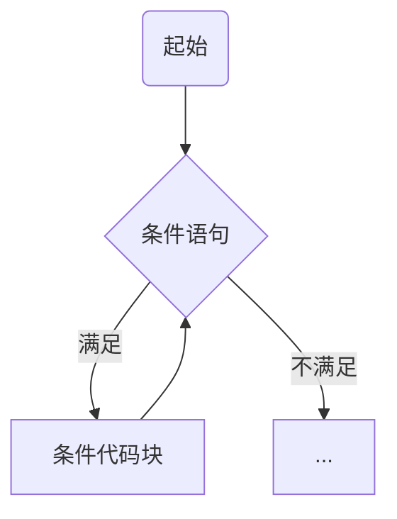
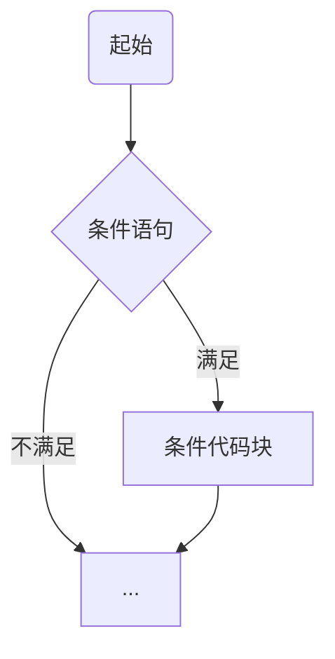
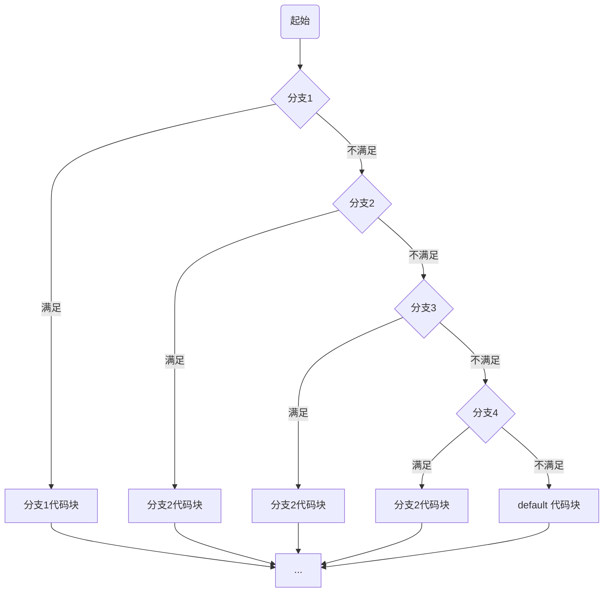

[TOC]

# `x.lang`

## 1、语言结构

> 按文件划分模块声明

### 1.1、包声明

> 所在文件夹名称

```x
pkg main;
```


### 1.2、引入文件

> 引入文件模块

```x
// 格式
import "pkgName.pkgName2.pkgName3.filename";
import "pkgName.pkgName5.*";

// 示例
import "demo.test.filename";
import "demo.x.*";

// 别名
import "demo.xx.filename as testFileName";
```


### 1.3、函数

> 面向过程时称为“函数”
>
> 可用 `pub`、`pri` 修饰其可见性

```x
// 主函数
// 名称:`main`，无参数，无返回值
fn main() {
}

// 一个普通函数
// 名称:`doX`，可见性：`pub`，无参数，无返回值
pub fn doX() {
}

// 文件内可见
// 有参数
pri fn private(int x, string a) {
}

// 默认包（目录）内可见
// 有返回值
fn protected() -> string {
	return "x.lang";
}
```


### 1.4、接口

```x
/**
 * 声明一个接口
 */
interface XInterface {

	/**
	 * 接口方法
	 */
	test(int x) -> string;
}
```


### 1.5、类

```x
/**
 * 普通类
 */
pub class XClass {
	// 成员变量
	string x;
	
	/**
	 * 方法
	 * 无需使用 fn 关键字
	 */
	pub test() {
	}
}

/**
 * 继承
 */
pub class AClass: XClass {}

/**
 * 继承 + 接口实现
 */
pub class BClass: XClass ~ XInterface {

	/**
	 * 必须实现接口的方法
	 */
	pub test(int x) -> string {
		return "x.lang";
	}
}
```


### 1.6、行分隔符

必须使用 `;` 作为行分隔符


### 1.7、注释

* 行注释

  ```x
  // 这是行注释，单行有效
  ```

* 块注释

  ```x
  /*
  	这是块注释
  */
  ```

* 文档注释

  ```x
  /**
   * 这是文档注释，注释文件头、函数、接口、类、字段、方法等，用于生成 `doc` 文档手册
   */
  ```


### 1.8、标识符

一个或是多个字母 `[a-zA-Z]` 数字 `[0-9]`、下划线 `_` 组成的序列，但是第一个字符必须是字母或下划线，不能是数字。


### 1.9、访问修饰符

* `pub`

  公共开放访问

* `pri`

  面向过程：当前文件访问

  面向对象：当前类访问

* 默认

  面向过程：当前包（目录）访问

  面向对象：当前类及其子类访问

| 修饰符 |  当前文件/当前类   |   当前包/子孙类    |    其他（开放）    |
| :----: | :----------------: | :----------------: | :----------------: |
| `pub`  | :heavy_check_mark: | :heavy_check_mark: | :heavy_check_mark: |
|  默认  | :heavy_check_mark: | :heavy_check_mark: |        :x:         |
| `pri`  | :heavy_check_mark: |        :x:         |        :x:         |


### 1.10、关键字表

|   关键字    |             描述             |            示例            |
| :---------: | :--------------------------: | :------------------------: |
|    `pkg`    |           包名声明           |         `pkg std;`         |
|  `import`   |             导入             |      `import std.*;`       |
|   `class`   |            类声明            |        `class X {}`        |
| `interface` |           接口声明           |      `interface X {}`      |
|   `enum`    |           枚举声明           |        `enum X {}`         |
| `annotate`  |           注解声明           |    `pub annotate X {}`     |
|    `abs`    |          抽象类声明          |    `pub abs class X {}`    |
|  `sealed`   |       不可被继承和重写       |  `pub sealed class X {}`   |
|    `is`     |      是否为某个类的实例      |    `if x is ClassX {}`     |
|    `as`     | 导入指定别名，多继承指定别名 |   `import a.b.c as cc;`    |
|    `pub`    |        公共访问修饰符        |     `pub string name;`     |
|    `pri`    |        私有访问修饰符        |       `pri int age;`       |
|    `fn`     |           函数声明           |        `fn test();`        |
|   `defer`   |     函数、方法的后置操作     |    `defer fn() {} ();`     |
|   `const`   |           常量定义           |    `const int A = 22;`     |
|   `this`    |           当前实例           |       `this.test();`       |
|   `super`   |            父实例            |      `super.test();`       |
|  `return`   |           返回结果           |        `return 22;`        |
|   `break`   |           跳出循环           |          `break;`          |
| `continue`  |  跳过本次循环，进入下次循环  |        `continue;`         |
|    `try`    |           捕获异常           |          `try {}`          |
|   `catch`   |           异常处理           |  `catch(MyError err) {}`   |
|  `finally`  |      捕获异常的后置操作      |        `finally {}`        |
|    `for`    |           循环语句           |     `for i := 0; ; {}`     |
|    `if`     |           条件语句           |   `if a > 0 {} else {}`    |
|   `else`    |           条件语句           |   `if a > 0 {} else {}`    |
|   `when`    |           分支语句           |        `when x {}`         |
|  `throws`   | 函数、方法可能抛出的异常声明 | `fn x() throws MyError {}` |
|   `throw`   |           抛出异常           |     `throw MyError();`     |
|    `nil`    |            空指针            |      `if nil == x {}`      |
|    `bee`    |           开启协程           |       `bee async();`       |
|   `goto`    |           标记跳转           |        `goto redo;`        |


## 2、数据类型

### 2.1、基本数据类型

#### 2.1.1、`byte`

> `8` 位有符号二进制补码（ `1` 字节）表示的整数

* 最小值 `-128 (-2^7)`
* 最大值 `127 (2^7 - 1)`
* 默认值 `0`
* 例子：`byte a = 100, byte b = -50`

#### 2.1.2、`short`

> `16` 位有符号二进制补码（ `2` 字节）表示的整数

* 最小值 `-32768 (-2^15)`
* 最大值 `32767 (2^15 - 1)`
* 默认值 `0`
* 例子： `short a = 100, short b = -200`

#### 2.1.3、`int`

> `32` 位有符号二进制补码（ `4` 字节）表示的整数

* 最小值 `-2,147,483,648 (-2^31)`
* 最大值 `2,147,483,647 (2^31 - 1)`
* 默认值 `0`
* 例子：`int a = 1000, int b = -23444`

#### 2.1.4、`long`

> `64` 位有符号二进制补码（ `8` 字节）表示的整数

* 最小值 `-9,223,372,036,854,775,808 (-2^63)`
* 最大值 `9,223,372,036,854,775,807 (2^63 - 1)`
* 默认值 `0`
* 例子：`long a = 10000000000, long b = -23223424444`

#### 2.1.5、`float`

> 符合 `IEEE-754` 的 `32` 位（ `4` 字节）单精度有符号浮点型数
>
> 不能用来表示精确的数值，如货币

* 最小值 `-2,147,483,648 (-2^31)`
* 最大值 `2,147,483,647 (2^31 - 1)`

* 默认值 `0.0`
* 例子：`float a = 3.14`

#### 2.1.6、`double`

> 符合 `IEEE-754` 的 `64` 位（ `8` 字节）单精度有符号浮点型数
>
> 不能用来表示精确的数值，如货币

* 最小值 `-9,223,372,036,854,775,808 (-2^63)`
* 最大值 `9,223,372,036,854,775,807 (2^63 - 1)`

* 默认值 `0.0`
* 例子：`double a = 3.14`

#### 2.1.7、`ubyte`

> `8` 位无符号二进制补码（ `1` 字节）表示的整数

* 最小值 `0`
* 最大值 `255 (2^8 - 1)`
* 默认值 `0`
* 例子：`ubyte a = 100, ubyte b = -50`

#### 2.1.8、`ushort`

> `16` 位无符号二进制补码（ `2` 字节）表示的整数

* 最小值 `0`
* 最大值 `65535 (2^16 - 1)`
* 默认值 `0`
* 例子： `ushort a = 100, ushort b = -200`

#### 2.1.9、`uint`

> `32` 位无符号二进制补码（ `4` 字节）表示的整数

* 最小值 `0`
* 最大值 `4,294,967,295 (2^32 - 1)`
* 默认值 `0`
* 例子：`uint a = 1000, uint b = -23444`

#### 2.1.10、`ulong`

> `64` 位无符号二进制补码（ `8` 字节）表示的整数

* 最小值 `0`
* 最大值 `18,446,744,073,709,551,615 (2^64 - 1)`
* 默认值 `0`
* 例子：`ulong a = 10000000000, ulong b = -23223424444`

#### 2.1.11、`bool`

> 用一个二进制位（ `1` 位）表示的整数

* 只有两个取值：`true` 和 `false`，即：`1` -> `true`，`0` -> `false`
* 默认值 `false`
* 例子：`bool a = true`

#### 2.1.12、`char`

> 一个单一的 `32` 位（ `4` 字节） `utf-8` 编码的 `Unicode` 字符
>
> 在 `utf-8` 编码中，从 `1` 到 `4` 个字节不等，一个中文字符占三个字节, 一个英文字符占一个字节
>
> `0xxxxxx` 表示文字符号 `0～127`，兼容 `ASCII` 字符集
>
> 从 `128` 到 `0x10ffff` 表示其他字符

* 最小值 `0`
* 最大值 `4,294,967,295 (2^32 - 1)`
* 默认值 `0`
* 例子：`char a = 'x', char b = '中'`

#### 2.1.13、`string`

> 字符串就是一串固定长度的字符连接起来的字符序列
>
> 由 `char` 数组连接构成
>
> 使用 `utf-8` 编码的 `Unicode` 文本

* 示例：`string x = "x.lang"`


### 2.2、复合类型

> 即面向对象模块
>
> 详细请参照 `面向对象` 模块

通过定义一个类来作为一个类型


## 3、变量类型

采用小驼峰（`camelCase`）命名规范

### 3.1、格式

> 所有变量在使用前必须先声明
>
> 声明格式如下

```tex
// 指定类型声明
type identifier [ = value][, identifier [ = value] ...];

// 自动推导类型
identifier [, identifier [...]] := value [, value [...]]; 
```

**格式说明**

* `type`

  类型

* `identifier`

  变量名，可以使用逗号 `,` 隔开来声明多个同类型变量

* `value`

  变量值


### 3.2、类型

* 局部变量

  定义在方法、构造方法、函数或者语句块中的变量，作用域只限于当前代码块

  不能被访问修饰符修饰

  ```tex
  type varName;
  ```

  * `type`

    变量类型

  * `varName`

    变量名称

* 成员变量

  定义在类中、方法之外的变量，作用域为整个类，可以被类中的任何方法、语句块访问

  取决于被访问修饰符的修饰

  ```tex
  [pub | pri] type varName;
  ```

  * `type`

    变量类型

  * `varName`

    变量名称

* 全局变量

  定义在类外、函数外、文件内的变量，作用域为整个工程，可以被工程中任意文件、类、函数和代码块访问

  取决于被访问修饰符的修饰

  ```tex
  [pub | pri] type varName;
  ```

  * `type`

    变量类型

  * `varName`

    变量名称

* 参数变量

  方法、函数定义时声明的形参变量，作用域为方法、函数内部

  不能被访问修饰符修饰

  ```tex
  [pub | pri] fn functionName(type paramName1, paramName2, type paramName3, ...) -> [returnType [, returnType ...]] {
  	// 函数体
  }
  
  [pub | pri] methodName(type paramName1, paramName2, type paramName3, ...) -> [returnType [, returnType ...]] {
  	// 方法体
  }
  ```

  * `functionName`

    函数名

  * `methodName`

    方法名

  * `type`

    变量类型

  * `paramName...`

    参数变量名称

  * `returnType`

    返回值类型


## 4、常量

> 一个简单值的标识符，在程序运行时不会被修改的量
>
> 使用 `const` 关键字声明定义
>
> 可以被访问修饰符修饰

```tex
[pub | pri] const type IDENTIFIER = VALUE;
```

**格式说明**

* `type`

  类型

* `IDENTIFIER`

  常量名，采用大写下划线（`UPPER_SNAKE_CASE`）命名规范

* `VALUE`

  常量值


## 5、运算符

### 5.1、算术运算符

> 设 `A` 值为 `10`，`B` 值为 `20`

| 运算符 | 描述 |         实例         |
| :----: | :--: | :------------------: |
|  `+`   | 相加 | `A + B` 结果为 `30`  |
|  `-`   | 相减 | `A - B` 结果为 `-10` |
|  `*`   | 相乘 | `A * B` 结果为 `200` |
|  `/`   | 相除 |  `B / A` 结果为 `2`  |
|  `%`   | 求余 | `A % B` 结果为 `10`  |
|  `++`  | 自增 |  `A++` 结果为 `11`   |
|  `--`  | 自减 |  `B--` 结果为 `19`   |


### 5.2、关系运算符

> 设 `A` 值为 `10`，`B` 值为 `20`

| 运算符 |   描述   |          实例           |
| :----: | :------: | :---------------------: |
|  `==`  |   相等   | `A == B` 结果为 `false` |
|  `!=`  |   不等   | `A != B` 结果为 `true`  |
|  `>`   |   大于   | `A > B` 结果为 `false`  |
|  `<`   |   小于   |  `A < B` 结果为 `true`  |
|  `>=`  | 大于等于 | `A >= B` 结果为 `false` |
|  `<=`  | 小于等于 | `A <= B` 结果为 `true`  |


### 5.3、逻辑运算符

> 设 `A` 值为 `true`，`B` 值为 `false`

| 运算符 |           描述            |           实例            |
| :----: | :-----------------------: | :-----------------------: |
|  `&&`  | 逻辑 `AND` 运算符，短路与 |  `A && B` 结果为 `false`  |
|  `||`  | 逻辑 `OR` 运算符，短路或  |  `A || B` 结果为 `true`   |
|  `!`   |     逻辑 `NOT` 运算符     | `!(A && B)` 结果为 `true` |


### 5.4、位运算符

> 假定 `A = 60; B = 13;` 其二进制数转换为：
>
> ```tex
> A = 0011 1100
> 
> B = 0000 1101
> 
> -----------------
> 
> A&B = 0000 1100
> 
> A|B = 0011 1101
> 
> A^B = 0011 0001
> 
> ```

| 运算符 |  描述  |                    实例                     |
| :----: | :----: | :-----------------------------------------: |
|  `&`   | 按位与 |  `A & B` 结果为 `12`，二进制为 `0000 1100`  |
|  `|`   | 按位或 |  `A | B` 结果为 `61`，二进制为 `0011 1101`  |
|  `^`   |  异或  |  `A ^ B` 结果为 `49`，二进制为 `0011 0001`  |
|  `<<`  |  左移  | `A << 2` 结果为 `240`，二进制为 `1111 0000` |
|  `>>`  |  右移  | `A >> 2` 结果为 `15`，二进制为 `0000 1111`  |


### 5.5、赋值运算符

| 运算符 |     描述     |                    实例                     |
| :----: | :----------: | :-----------------------------------------: |
|  `=`   |   简单赋值   | `C = A + B` 将 `A + B` 表达式结果赋值给 `C` |
|  `+=`  |  相加后赋值  |          `C += A` 等于 `C = C + A`          |
|  `-=`  |  相减后赋值  |          `C -= A` 等于 `C = C - A`          |
|  `*=`  |  相乘后赋值  |          `C *= A` 等于 `C = C * A`          |
|  `/=`  |  相除后赋值  |          `C /= A` 等于 `C = C / A`          |
|  `%=`  |  求余后赋值  |          `C %= A` 等于 `C = C % A`          |
| `<<=`  |  左移后赋值  |         `C <<= A` 等于 `C = C << A`         |
| `>>=`  |  右移后赋值  |         `C >>= A` 等于 `C = C >> A`         |
|  `&=`  | 按位与后赋值 |          `C &= A` 等于 `C = C & A`          |
|  `|=`  | 按位或后赋值 |          `C |= A` 等于 `C = C | A`          |
|  `^=`  |  异或后赋值  |          `C ^= A` 等于 `C = C ^ A`          |


### 5.6、运算符优先级

> 下表列出了所有运算符以及它们的优先级，由上至下代表优先级由高到低

| 优先级 |                运算符                |
| :----: | :----------------------------------: |
|  `5`   | `*`、`/`、`%`、`<<`、`>>`、`&`、`&^` |
|  `4`   |          `+`、`-`、`|`、`^`          |
|  `3`   |   `==`、`!=`、`<`、`<=`、`>`、`>=`   |
|  `2`   |                 `&&`                 |
|  `1`   |                 `||`                 |


## 6、循环语句

以下为循环语句流程图




### 6.1、格式

> 仅提供 `for` 循环语句

```tex
// 普通循环
for [[type varName = value]; [value?]; [value++]] {
	// 条件代码块
}

// 迭代器-1
for index, item in iterator {
}

// 迭代器-2
for index, item in 0..200 {
}


// 示例
// 无限循环
for {
}
for ; ; {
}

// 定义一个局部变量 x 并初始化
for int x = 1; ; {
}

// x < 10 当做循环条件
for ; x < 10; {
}

// 每次循环后 x 自增
for ; ; x++ {
}

// 三者结合
for int x = 1; x < 10; x++ {
}
```


### 6.2、循环控制语句

|    语句    |             描述             |
| :--------: | :--------------------------: |
|  `break`   |         中断当前循环         |
| `continue` | 跳过本轮循环，进入下一轮循环 |
|   `goto`   |   将控制转移到被标记的语句   |


## 7、条件语句

以下为条件语句的流程图



### 7.1、`if .. else ..`

```tex
if 布尔表达式 {
	// 满足条件时执行的代码块
} [else if ... { ... } else { ... }]

// 示例
if a < 10 {
	println("a < 10");
} else if a < 20 {
	println("a < 20");
} else {
	println("a >= 20");
}
```


### 7.2、三目运算符（`?:`）

```tex
[type varName = ] 布尔表达式 ? [正向结果 | 三目运算符] : [反向结果 | 三目运算符];

// 示例
// 正常
int x = a > 10 ? 1 : 2;

// 无需接收返回值
a > 10 ? execA() : execB();

// 条套
int x = a > 10 ? 1 : a > 20 ? 2 : 3;
```


## 8、分支语句

以下为分支语句的流程图




> `when .. case ..`

```tex
when 变量 {
	值1 -> {语句}
	值2 -> {语句}
	值3, 值4 -> {语句}
	_ -> {default 语句}
}

// 示例
when x {
	1 -> println("x = 1")
	2 -> {println("x = 2");}
	3,4 -> println("x = 3 or x = 4")
	_ -> println("这里是 default 模块")
}
```


## 9、数组

> TODO: 能否支持动态扩容？

### 9.1、声明变量和初始化

```tex
// 声明一个数组
type[size] arrName;

// 声明并初始化一个数组
// 不指定元素时使用当前类型的默认值填充数据
type[size] arrName = type[size];
// 使用默认初始容量
type[] arrName = type[];

// 指定元素时直接初始化
// 指定初始容量
type[size] arrName = type[size] {1, 2, 3, 4, ...};
// 使用默认初始容量
type[] arrName = type[] {1, 2, 3, 4, ...};


// 自动推导类型
// 指定初始容量
arrName := type[size];
// 使用默认初始容量
arrName := type[];

// 指定初始容量
arrName := type[size] {1, 2, 3, 4};
// 使用默认初始容量
arrName := type[] {1, 2, 3, 4};

// 根据赋值的元素数量来确定初始容量
arrName := {1, 2, 3, 4};
```


### 9.2、数组访问处理

以下操作示例中：

```x
// 创建一个示例数组
int[] arr = int[];
```

* 数组长度

  `length` 属性

  ```x
  // 获取数组的长度
  int length = arr.length;
  ```

* 添加元素

  * `push(...)` 方法

    将元素添加到数组的末尾，并返回新的长度

    ```x
    int newLength = arr.push(2);
    ```

  * `unshift(...)` 方法

    将元素添加到数组的开头，并返回新的长度

    ```x
    int newLength = arr.unshift(3);
    ```

* 删除元素

  * `pop(...)` 方法

    删除数组的最后一个元素，并返回该元素

    ```x
    int item = arr.pop();
    ```

  * `shift(...)` 方法

    删除数组的第一个元素，并返回该元素

    ```x
    int item = arr.shift();
    ```

* 读取和更新元素

  直接用数组下标访问

  > 如果下标超过数组长度则抛出异常

  ```x
  // 获取第一个元素
  int item = arr[0];
  
  // 更新第二个元素为 100
  arr[1] = 100;
  ```

* 反转数组

  提供 `reverse()` 方法，实现数组元素的反转

  ```x
  int[] reversedArr = arr.reverse();
  ```

* 连接数组

  提供 `concat(...)` 方法，实现当前数组与一个或多个数组的拼接

  > 要求待拼接的数组类型与当前数组类型一致，否则语法不通过

  ```x
  int[] a = int[] {2, 3, 4};
  int[] b = int[] {5, 4, 8};
  
  // 拼接一个数组
  int[] newArr = arr.concat(a);
  
  // 拼接多个数组
  int newArr = arr.concat(a, b);
  
  // 拼接一个自动推导类型的数组
  int newArr = arr.concat({9, 6, 3, 0});
  ```

* 连接元素

  提供 `join(string with)` 方法，实现将数组元素按指定参数拼接成字符串的功能

  ```x
  string result = arr.join(", ");
  
  // 输出结果：1, 2, 3, 4
  println(result);
  ```

* 查找索引

  * `indexOf(...)` 方法

    查找元素第一次出现的位置索引

    ```x
    int index = arr.indexOf(2);
    ```

  * `lastIndexOf(...)` 方法

    查找元素最后一次出现的位置索引

    ```x
    int index = arr.lastIndexOf(2);
    ```


### 9.3、遍历数组

* 普通遍历

  ```x
  for int i = 0; i < arr.length; i++ {
  	println("item[{i}] = {}", arr[i]);
  }
  ```

* 迭代遍历

  ```x
  for index, item in arr {
  	println("arr[{index}] = {item}");
  }
  ```

### 9.4、数组作为参数

> 数组作为参数时为引用传递，如果被调用的函数内对参数数组进行了写操作，调用者处的数组将会受到同样的影响

```x
// 调用函数
doX(arr);
// 调用后此处的 arr[1] 元素将是修改后的 100

fn doX(int[] arr) {
	// 函数内对参数数组的元素进行了修改
	arr[1] = 100;
}
```


### 9.5、数组作为返回值

> 返回数组的作用域将自动延伸到与调用方作用域对齐

```x
// createArr() 返回数组的作用域将与 newArr 对齐
int[] newArr = createArr();

fn createArr() -> int[] {
	// 返回一个数组
	return {1, 2, 3};
}
```


### 9.6、多维数组

> 当声明数组元素的类型也是数组时，将构成多维数组

```x
// 格式
type[size1][size2]... arrName;

// 示例（二维数组）
int[10][20] arr = int[10][20];
```


## 10、错误处理

### 10.1、标准接口

> 需要实现标准接口方能作为错误异常类

* `Error` 接口

  抛出异常，进程不受影响

  * 该接口的定义源码

    ```x
    interface Error {
    }
    ```

  * 实现自定义异常

    ```x
    pub class MyError ~ Error {
    }
    ```

  

### 10.2、声明错误与抛出

如果一个函数或方法内需要抛出错误，需要现在函数或方法上声明异常类

提供 `throws` 关键字用来声明错误，`throw` 关键字用来抛出错误

```x
// 函数
pub fn doX() -> int, string throws MyPanic {
	// 抛出
	throw MyPanic();
}

pub class A {

	// 方法
	pub deal() -> int, string throws MyError, AnError {
		throw MyError();
	}
}
```


### 10.3、错误捕获

> 在可能出现异常的调用处使用 `try {...} catch(Error err) {} finally {}` 来捕获错误异常

```x
try {
	int x, str = doX();
	println("x = {x}, str = {str}");
} catch(MyError err) {
	// 错误处理
} finally {
	// 代码片段
}
```


## 11、类

### 11.1、普通用法

#### 11.1.1、类的定义

* 格式

  ```x
  /**
   * 类的 doc 注释
   */
  [pub | pri] [sealed] class ClassName {
  }
  ```

  * 访问修饰符

    可使用默认、`pub`、`pri` 三种访问修饰符

  * `sealed` 关键字

    被 `sealed` 关键字修饰的类不可被其他类继承

    被 `sealed` 关键字修饰的方法不可被子类重写

  * `doc` 文档注释

    用于生成 `doc` 文档说明

  * `ClassName` 类名

    采用大驼峰（`PascalCase`）命名规范

* 示例

  * 无访问修饰符

    ```x
    /**
     * 该类只能包内被访问
     */
    class ClassX {
    }
    ```

  * 有访问修饰符

    ```x
    /**
     * 该类不可被访问
     */
    pri class ClassX {
    }
    
    /**
     * 该类可被任意访问
     */
    pub class ClassX {
    }
    ```

  * 不可被继承

    ```x
    sealed class ClassX {
    }
    ```


### 11.2、构造方法

#### 11.2.1、格式

```x
[pub | pri] ClassName([type paramName [, type paramName1 ...]]) {
	// 给字段初始化赋值
}
```

* 访问修饰符

  * `pub`

    可被外界任意访问

  * `pri`

    仅可在当前文件内访问

    > 以文件 `/demo/demo.x` 文件为例

    ```x
    class Demo {
    
    	pri Demo() {}
    }
    
    // 仅在当前文件可访问
    pub fn createDemo() -> Demo {
    	return Demo();
    }
    ```

  * 默认

    仅可被当前包和子孙类访问

* 方法名

  与类名一致

* 参数

  参数列表与普通函数相同用法

* 返回值

  不声明返回值类型

  返回值为当前类的一个实例


### 11.3、成员

> 成员变量和方法

#### 11.3.1、变量（字段）

命名规范跟 “变量” 一致

* 格式

  ```x
  /**
   * 字段的文档注释
   */
  [pub | pri] type fieldName;
  ```

  * 访问修饰符

    可使用默认、`pub`、`pri` 三种访问修饰符

  * 字段的文档注释

    用于生成 `doc` 文档说明

  * `type`

    字段类型

  * `fieldName` 字段名

    采用小驼峰（`camelCase`）命名规范

* 使用

  `pub` 修饰的字段可通过实例直接访问

  ```x
  class ClassX {
  	pub string name;
  }
  
  fn main() {
  	// 使用默认的空参构造函数
  	ClassX x = ClassX();
  	// 通过实例直接访问公开字段
  	println("x.name = {}", x.name);
  	
  	// 修改
  	x.name = "X";
  }
  ```

  `pri` 修饰的字段不可被外界直接访问，仅可在当前类直接访问，外界需借助相应的 `getX()` 和 `setX(...)` 方法来进行访问操作

  ```x
  class ClassX {
  	pri string name;
  	
  	// 需要提供对应的 get 和 set 方法
  	
  	pub getName() -> string {
  		return name;
  	}
  	
  	pub setName(string name) {
  		this.name = name;
  	}
  }
  
  fn main() {
  	// 使用默认的空参构造函数
  	ClassX x = ClassX();
  	// 通过 getX() 方法访问
  	println("x.name = {}", x.getName());
  	
  	// 修改
  	x.setName("X");
  }
  ```

  默认无访问修饰符的字段j仅可被其子孙类访问

  ```x
  class Root {
  	string name;
  }
  
  class Parent : Root {
  	string age;
  	
  	pub doX() {
  		println("name = {name}, age = {age}");
  	}
  }
  
  class X : Parent {
  	string count;
  	
  	pub doX() {
  		println("name = {name}, age = {age}, count = {count}");
  	}
  }
  ```

####  11.3.2、方法

> 类提供用于操作处理字段的一类行为函数

* 格式

  ```tex
  [pub | pri] methodName([type paramName [, type paramName1 ...]]) [-> returnType [, returnType ...]] [throws ErrorClass [, Error2 ...]] {
  	// 函数体
  }
  ```

  * 访问修饰符

    访问修饰符与字段用法一致

  * 方法名

    采用小驼峰（`camelCase`）命名规范

  * 参数列表

    无参、一个或多个参数

  * 返回值列表

    用符号 `->` 指定返回值列表及其类型

  * 异常错误

    用 `throws` 关键字声明可能会抛出的异常类型

* 示例

  ```x
  class X {
  
  	/**
  	 * pub 修饰
  	 * 一个 string 类型的参数 name
  	 * 一个 string 类型的返回值
  	 * 一个异常错误 MyError 声明
  	 */
  	pub doX(string name) -> string throws MyError {
  		if name == "" {
  			throw MyError("姓名不能为空");
  		}
  		return format("name = {name}");
  	}
  }
  
  fn main() {
  	X x = X();
  	
  	try {
  		string result = x.doX("姓名");
  		println(result);
  	} catch(MyError err) {
  		panic(err);
  	}
  }
  ```


### 11.4、继承

> 支持单继承与多继承，多继承时必须为父类们指定别名
>
> `sealed` 修饰的类不可被继承

使用 `:` 实现类的继承关系

```tex
[pub | pri] class ClassName : ParentClassName {
}
```

#### 11.4.1、单继承

```x
pub class Parent {
	pri string name;
	
	pub Parent(string name) {
		this.name = name;
	}
	
	pub getName() -> string {
		return name;
	}
}

pub class X : Parent {
	pub string age;
	
	pub X(string name, int age) {
		super(name);
		this.age = age;
	}
}

// 外部访问
fn main() {
	X x = X("姓名", 22);
	println("x.name = {}, x.age = {}", x.getName(), x.age);
}
```

#### 11.4.2、多继承

> 多继承需要分别指定父类的别名，以解决构造方法的初始化和方法重写冲突的问题
>
> 如果所继承的多个父类中有签名相同的方法，则子类必须重新实现该方法

使用 `as` 关键字为每个关键字指定别名

多个父类直接用 `,` 隔开

```x
pub class Father {
	pri string name;
	
	pub Father(string name) {
		this.name = name;
	}
	
	pub getName() -> string {
		return name;
	}
	
	pub doX() -> string {
		// 这是 Father 类的 doX() 方法实现
		return "Father";
	}
}

pub class Mother {
	pri int age;
	
	pub Mother(int age) {
		this.age = age;
	}
	
	pub getAge() -> int {
		return age;
	}
	
	pub doX() -> string {
		// 这是 Mother 类的 doX() 方法实现
		return "Mother";
	}
}

pub class X : Father as fa, Mother as mo {
	pub int count;

	pub X(string name, int age, count) {
		// 此处无法使用 super 来初始化父类
		// 必须使用别名初始化
		fa(name);
		mo(age);
		
		// 父类初始化完后才能初始化当前类的字段
		this.count = count;
	}
	
	/**
	 * 由于两个父类中都有该方法，所以此处必须重写，否则调用方将无法得知该方法的执行逻辑
	 */
	pub doX() -> string {
		// 如果以 Father 类的实现为准
		return fa.doX();
		
		// 如果以 Mother 类的实现为准
		return mo.doX();
		
		// 也可以实现自己的逻辑
		string resFa = fa.doX();
		string resMo = ma.doX();
		return format("resFa = {resFa}, resMo = {resMo}");
	}
}

// 外部调用
fn main() {
	X x = X("姓名", 22, 10);
	println("x.name = {}, x.age = {}, x.count = {}, x.doX() = {}", x.getName(), x.getAge(), x.count, x.doX());
}
```

#### 11.4.3、重写

对于父类中的某些方法，子类需要有自己的实现逻辑。此时需要通过重写操作来实现该方法的自定义。

要求访问修饰符、方法名、返回值列表、错误异常声明列表 保持一致方能实现重新功能。

```x
pub class Parent {
	pri string name;
	
	pub Parent(string name) {
		this.name = name;
	}
	
	pub getName() -> string {
		return name;
	}
	
	pub doX() -> string {
		// 这是 Parent 类的 doX() 方法实现
		return "Parent";
	}
}

pub class X : Parent {
	pub string age;
	
	pub X(string name, int age) {
		super(name);
		this.age = age;
	}
	
	/**
	 * 重写实现自己的逻辑
	 */
	pub doX() -> string {
		string res = super.doX();
		return format("res = {res}");
	}
}

// 外部访问
fn main() {
	X x = X("姓名", 22);
	println("x.name = {}, x.age = {}, x.doX() = {}", x.getName(), x.age, x.doX());
}
```


## 12、重载

同一个类内，具有相同的方法名，却有不同的参数列表的现象叫做重载，跟返回值类型和异常声明列表无关。

即类提供相同行为的多中方法，至于要调用哪个方法需要由调用方决定。

通过调用方所传的实参列表自动匹配对应的方法被调用。

```x
pub class X {

	pub doX() -> string throws MyError {}
	
	pub doX(string name) -> string throws MyError {}
	
	// 与返回值无关，这种是错的
	// 因为已经存在相同方法名和参数列表的方法
	pub doX() {}
	
	// 与异常类型无关，这种也是错的
	// 因为已经存在相同方法名和参数列表的方法
	pub doX(string name) -> int throws MyError {}
}
```


## 13、接口

具有共同性质和行为却行为方式多样化的一类事物的抽象统称

用关键字 `interface` 来定义

### 13.1、格式

```tex
[pub | pri] interface InterfaceName {

	[methodName([type paramName [, ...]]) [ -> returnType [, ...]] [throws Error1 [, ...]];]
}
```

* 访问修饰符

  访问修饰符与 “类” 用法一致

* `interface`

  用 `interface` 声明接口

* `InterfaceName`

  接口名称，命名规范与 “类” 一致

* 方法声明

  `pub` 访问修饰符，不可变更，且无需手动指定

  方法签名与 “类” 一致，但此处不能有方法体，方法签名结束需要以 `;` 结束


### 13.2、实现

> 接口不可直接创建实例
>
> 需要定义类来实现接口，才能通过创建类的实例来创建具有接口行为的实例

通过符号 `~` 来定义接口实现功能

必须实现接口声明的所有方法

```x
/**
 * 接口声明
 */
pub interface XInterface {
	
	/**
	 * 声明接口方法
	 */
	doX(string param) -> string, int throws MyError;
	
	/**
	 * 可重载
	 */
	doX(string param, int param1) -> string, int throws MyError;
}

/**
 * 通过符号 ~ 来实现接口
 */
pub class X ~ XInterface {

	/**
	 * 实现接口所定义的方法
	 */
	pub doX(string param) -> string, int throws MyError {
		return param, 10;
	}
	
	/**
	 * 可重载
	 */
	pub doX(string param, int param1) -> string, int throws MyError {
		return param, param1;
	}
}
```


## 14、抽象类

一种特殊的类，可以拥有自己的字段和方法，但也有一些无法实现的方法，这些方法需要由继承该类的子类来具体实现

用关键字 `abs` 来定义

### 14.1、格式

```tex
[pub | pri] abs class AbsClassName {

	[methodName([type paramName [, ...]]) [ -> returnType [, ...]] [throws Error1 [, ...]];]
}
```

* 访问修饰符

  访问修饰符与 “类” 用法一致

* `abs`

  用 `abs` 关键字声明类为抽象类

* `AbsClassName`

  接口名称，命名规范与 “类” 一致

* 方法声明

  `pub` 访问修饰符，不可变更，且无需手动指定

  方法签名与 “类” 一致，但此处不能有方法体，方法签名结束需要以 `;` 结束


### 14.2、实现

> 抽象类也不可直接创建实例
>
> 需要定义类来继承该类并实现响应的抽象方法，才能通过创建类的实例来创建该抽象类的实例

通过符号 `:` 来继承类

必须实现父类声明的抽象方法

```x
/**
 * 声明类为 抽象类
 */
pub abs class AbsClass {
	
	/**
	 * 声明为抽象方法
	 */
	doX(string param) -> string, int throws MyError;
	
	/**
	 * 可重载
	 */
	pub doX(string param, int param1) -> string, int throws MyError {
		// 已实现的方法
		return param, param1;
	}
}

/**
 * 通过符号 : 来继承类
 */
pub class X : AbsClass {

	/**
	 * 实现父类所声明的抽象方法
	 */
	pub doX(string param) -> string, int throws MyError {
		return param, 10;
	}
}
```


## 15、枚举

一种特殊的类，所建实例均为 “常量”

用关键字 `enum` 来定义。

### 15.1、格式

```tex
[pub | pri] enum EnumName [ ~ InterfaceName [, InterfaceName1 ...]] {
	[MEMBER [, MEMBER1 ...]];
	
	[type fieldName;]
	...
	
	[EnumName([type param ...]) {
		// 构造方法
	}]
	
	[[pub | pri] methodName([type param ...]) [ -> returnType ... throws Error ... ] {
		// 方法体
	}]
}
```

* 访问修饰符

  访问修饰符与 “类” 用法一致

* `enum`

  用 `enum` 关键字来声明枚举类

* `EnumName`

  类名，命名规范与 “类” 一致

* 实现接口

  可实现一些接口，用法与 “类” 一致

* 枚举值

  一些实例

  访问修饰符为 `pub`，不可手动指定

  需要通过构造方法创建

  命名规范与 “常量” 一致

  多个实例之间用 `,` 分割，结尾用 `;` 指定

* 字段

  访问修饰符为 `pri`，不可手动指定

  其他用法与 “类” 一致

* 构造方法

  访问修饰符为 `pri`，不可手动指定

  其他用法与 “类” 一致

* 方法

  用法与 “类” 一致


### 15.2、使用

#### 15.2.1、声明

```x
/**
 * 普通声明，无字段和方法等
 */
pub enum Color {
	RED, ORANGE, YELLOW, GREEN, BLUE, INDIGO, VIOLET;
}

/**
 * 复杂声明，有字段和方法
 * 还实现了 ToString 接口
 */
pub enum ColorWithName ~ ToString {
	RED("红色"),
	ORANGE("橙色"),
	YELLOW("黄色"),
	GREEN("绿色"),
	BLUE("蓝色"),
	INDIGO("靛色"),
	VIOLET("紫色"),
	;
	
	string colorName;
	
	ColorWithName(string colorName) {
		this.colorName = colorName;
	}
	
	pub getColorName() -> string {
		reutrn colorName;
	}
	
	/**
	 * 实现 ToString 接口的 toString() 方法
	 */
	 pub toString() -> string {
	 	return format("color = {colorName}");
	 }
}
```

#### 15.2.2、外部调用

```x
fn main() {
	Color red = Color.RED;
	// 输出为：red = RED
	println("red = {red}");
	
	// 结合 when 使用
	when color {
		RED -> println("红色"),
		GREEN, VIOLET -> println("绿色或紫色"),
		_ -> println("其他颜色")
	}
	
	ColorWithName cwn = ColorWithName.BLUE;
	// 输出为：cwn = BLUE
	println("cwn = {red}");
	// 输出为：颜色名称为：蓝色
	println("颜色名称为：{}", cwn.toString());
}
```

#### 15.2.3、枚举值迭代

枚举类内置 `values()` 方法返回所有的枚举值成员为数组

```x
fn main() {
	ColorWithName[] values = ColorWithName.values();
	// 可迭代遍历
	for index, item in values {
		println("index = {index}, item = {item}, item.name = {}", item.toString());
	}
}
```


## 16、多态

多态是同一行为具有多个不同表现形式或形态的能力

### 16.1、存在的三个必要条件

* 继承
* 重写
* 父类引用指向子类对象，`Parent x = Child();`


### 16.2、常规用法

* 父类引用声明指向子类对象
* 函数形参类型


## 17、注解

凌驾于语言应用之上却又达不到代码编译功能的一种特殊能力定义，也属于一种特殊的类

> 注解真是个好东西呀~

### 17.1、格式

注解类需要由 `annotate` 关键字定义

```x
@Target(CLASS [, FIELD, METHOD, FN ...])
[pub | pri] annotate AnnoName {
	[string value;]
	[int count;]
	[string[] names;]
	[string text = "默认值";]
}
```

* `@Target()`

  指定该注解类的作用范围

* 访问修饰符

  与 “类” 用法一致

* `annotate`

  用于声明 “注解” 的关键字

* `AnnoName`

  注解类的名称，命名规范与 “类” 一致

* 成员

  所有成员都是 `pub` 修饰符，不可指定

  `value` 作为默认字段名称，可随意指定其类型

  定义时如果不指定默认值，则每个字段的默认值为该字段类型的默认值

  使用注解时无需重写全部字段，如果重写 `value` 字段，则可以省略该字段名


### 17.2、示例

* 定义一个注解类

  ```x
  /**
   * 定义一个注解类
   */
  @Target(CLASS)
  pub annotate AnnotationX {
  	
  	/**
  	 * 指定默认字段的类型为 string
  	 */
  	string value;
  	
  	/**
  	 * 一个 int 类型的字段，默认值为 0
  	 */
  	int age;
  	
  	/**
  	 * 默认值为 22
  	 */
  	int count = 22;
  }
  ```

* 使用注解类

  使用 `@` 符号来指定当前使用的注解类

  ```x
  @AnnotationX("指定 value 字段的值")
  pub class TestClass {}
  
  @AnnotationX(value = "也可以显示指定")
  
  // 其他字段必须显示指定
  @AnnotationX(age = 22)
  ```

* 注解内容获取

  > TODO：待定


## 18、泛型

顾名思义，广泛地指定一些类型的符号

可以用在任何地方

### 18.1、声明

泛型声明需要借助一个或多个 `<>` 对来完成

```x
/**
 * 在函数中声明
 * 可以用声明过的泛型来定义参数类型和返回值类型
 */
pub fn test<T>(T param) -> T {
	return param;
}s

/**
 * 在类上声明泛型
 * 在 X 类上声明一种名为 T 的泛型
 */
pub class X<T> {
	
	/**
	 * 声明后就可以用泛型代替类型来声明字段
	 * 则此处 data 字段的类型由最终创建 X 类对象时传入的类型决定
	 */
	pub T data;
	
	/**
	 * 在方法中使用
	 * 可以用声明过的泛型来定义参数类型和返回值类型
	 */
	pub test() -> T {
		return data;
	}
	
	/**
	 * 在方法中使用
	 * 也可以再声明一些未声明过的泛型
	 * 可以用声明过的泛型来定义参数类型和返回值类型
	 */
	pub test<U>(U param) -> T {
		return data;
	}
}
```


### 18.2、调用方

 在定义变量和调用方法时指定对应的泛型类型

一个变量的泛型类型一旦确定后将无法再进行修改

```x
fn main() {
	X<string> x = X<string>();
	
	// 构造函数处的泛型可省略
	X<string> x = X<>();
	
	// 自动推倒方式必须指定类型
	x := X<string>();
	
	// 调用方法
	string res = x.test();
	
	// 调用存在自定义泛型的方法
	// 调用处无需显示指定泛型类型，当然指定也没问题
	string res = x.test(22);
	string res = x.test<int>(22);
	
	// 调用有泛型的函数
	test<X<string>>(x);
	test(x);
}

pub fn test<B>(B b) {
	// doSth...
}
```


### 18.3、泛型擦除问题

> TODO：后续考虑实现


## 19、并发

并发采用 “协程” 实现

用 `bee` 关键字执行异步函数，配合内置类 `Channel<T>` 来进行各协程间的数据传递

`Channel<T>` 类的内部实现

```x
pub class Channel<T> {

	pub get() -> T {
		// 实现逻辑
	}
	
	pub send(T t) {
		// 实现逻辑
	}
}
```


### 19.1、普通用法

```x
/**
 * 定义一个函数
 */
fn asyncFn() {
}

fn asyncFn(MyChannel chan) {
	// 回传数据
	chan.send("Hello");
}

fn main() {
	// 异步执行函数
	// 调用时不关心其返回值
	bee asyncFn();
	
	// 协程中有数据回传
	Channel<string> chan = MyChannel();
	// 阻塞接收数据
	for {
		// 两种方式接收
		res := <- chan;
		// 也可以用 get() 方法接收
		res := chan.get();
		// 指定类型
		string res = chan.get();
		
		// res 就是协程中传回的数据
	}
	
	// 异步执行，传入 chan 参数
	bee asyncFn(chan);
	
	// 闭包写法
	// 需要将内部需要用到的变量通过闭包传递进去
	bee fn(int param) {
		println("param = {param}");
	} (22);
}

/**
 * 一般只需要自定义指定泛型类型即可，无需进行其他干涉
 */
class MyChannel : Channel<string> {
}
```


### 19.2、锁

> 并发操作中必然涉及公共资源的争抢，此时需要一把 “锁” 来配合使用才能保证资源被安全地调度使用

#### 19.2.1、互斥锁

内置的 `Mutex` 类

> TODO：待设计

#### 19.2.2、读写锁

内置的 `RwLock` 类

> TODO：待设计


## 20、内置函数

> 提供一些内置函数

### 20.1、`format` 函数

用于格式化字符串，返回格式化后的结果

两种方式的占位符

* `{}` 符号
* `{标识符}` 符号

```x
// 普通格式化
string res = format("name = {}, age = {}", "X.Lang", 22);

// 可直接在 {} 符号中指定在作用域内的标识符（变量、常量或者参数等）
string name = "X.Lang";
int age = 22;
string res = format("name = {name}, age = {age}");
```


### 20.2、`print` 函数

用于将字符串打印到控制台，无返回值

内部自动调用了 `format` 函数

```
// 直接打印
print("Hello X");

// 需先调用 format 函数，再打印其返回值
print("name = {}, age = {}", "X.Lang", 22);
```


### 20.3、`println` 函数

在传入的字符串末尾加上换行符（`\n` 或 `\r\n`）

再调用 `print` 函数将数据打印到控制台

```x
println("Hello X");
println("name = {}, age = {}", "X.Lang", 22);
```


### 20.4、`panic` 函数

程序崩溃时，输出错误堆栈信息到控制台，最后再终结进程

调用 `println` 函数后主动终结进程

```x
panic("Hello X");
panic("name = {}, age = {}", "X.Lang", 22);
```

