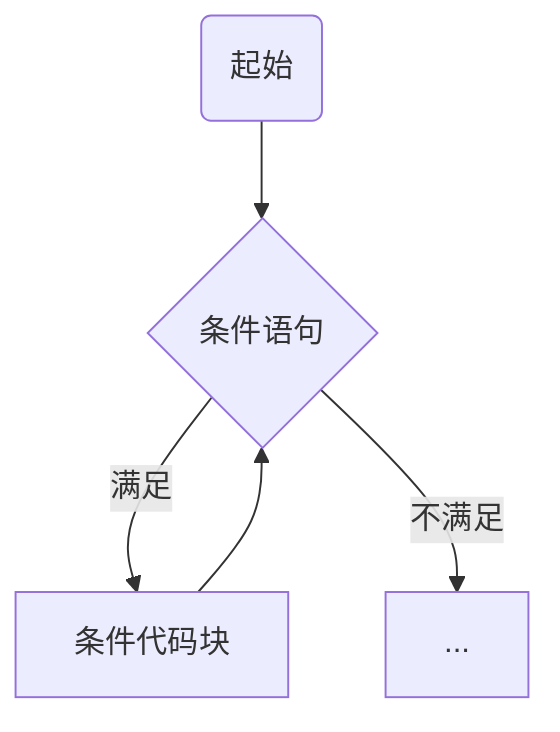
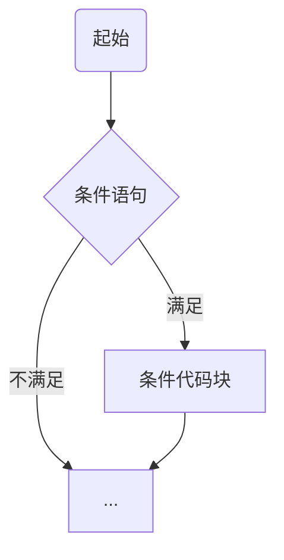
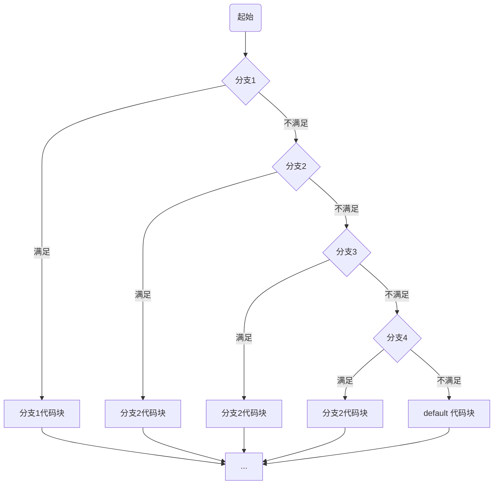

[TOC]

# `x.lang`

## 1、语言结构

> 按文件划分模块声明

### 1.1、包声明

> 所在文件夹名称

```x
pkg main;
```


### 1.2、引入文件

> 引入文件模块

```x
import "demo/test/filename";
```


### 1.3、函数

> 面向过程时称为“函数”
>
> 可用 `pub`、`pri` 修饰其可见性

```x
// 主函数
// 名称:`main`，可见性：`pub`，无参数，无返回值
pub fn main() {
}

// 文件内可见
// 有参数
pri fn private(int x, string a) {
}

// 默认包（目录）内可见
// 有返回值
fn protected() -> string {
	return "x.lang";
}
```


### 1.4、接口

```x
/**
 * 声明一个接口
 */
interface XInterface {

	/**
	 * 接口方法
	 */
	test(int x) -> string;
}
```


### 1.5、类

```x
/**
 * 普通类
 */
pub class XClass {
	// 成员变量
	string x;
	
	/**
	 * 方法
	 * 无需使用 fn 关键字
	 */
	pub test() {
	}
}

/**
 * 继承
 */
pub class AClass: XClass {}

/**
 * 继承 + 接口实现
 */
pub class BClass: XClass ~ XInterface {

	/**
	 * 必须实现接口的方法
	 */
	pub test(int x) -> string {
		return "x.lang";
	}
}
```


### 1.6、行分隔符

必须使用 `;` 作为行分隔符


### 1.7、注释

* 行注释

  ```x
  // 这是行注释，单行有效
  ```

* 块注释

  ```x
  /*
  	这是块注释
  */
  ```

* 文档注释

  ```x
  /**
   * 这是文档注释，注释文件头、函数、接口、类、字段、方法等，用于生成 `doc` 文档手册
   */
  ```


### 1.8、标识符

一个或是多个字母 `[a-zA-Z]` 数字 `[0-9]`、下划线 `_` 组成的序列，但是第一个字符必须是字母或下划线，不能是数字。


### 1.9、访问修饰符

* `pub`

  公共开放访问

* `pri`

  面向过程：当前文件访问

  面向对象：当前类访问

* 默认

  面向过程：当前包（目录）访问

  面向对象：当前类及其子类访问

| 修饰符 |  当前文件/当前类   |   当前包/子孙类    |    其他（开放）    |
| :----: | :----------------: | :----------------: | :----------------: |
| `pub`  | :heavy_check_mark: | :heavy_check_mark: | :heavy_check_mark: |
|  默认  | :heavy_check_mark: | :heavy_check_mark: |        :x:         |
| `pri`  | :heavy_check_mark: |        :x:         |        :x:         |


## 2、数据类型

### 2.1、基本数据类型

#### 2.1.1、`byte`

> `8` 位有符号二进制补码（ `1` 字节）表示的整数

* 最小值 `-128 (-2^7)`
* 最大值 `127 (2^7 - 1)`
* 默认值 `0`
* 例子：`byte a = 100, byte b = -50`

#### 2.1.2、`short`

> `16` 位有符号二进制补码（ `2` 字节）表示的整数

* 最小值 `-32768 (-2^15)`
* 最大值 `32767 (2^15 - 1)`
* 默认值 `0`
* 例子： `short a = 100, short b = -200`

#### 2.1.3、`int`

> `32` 位有符号二进制补码（ `4` 字节）表示的整数

* 最小值 `-2,147,483,648 (-2^31)`
* 最大值 `2,147,483,647 (2^31 - 1)`
* 默认值 `0`
* 例子：`int a = 1000, int b = -23444`

#### 2.1.4、`long`

> `64` 位有符号二进制补码（ `8` 字节）表示的整数

* 最小值 `-9,223,372,036,854,775,808 (-2^63)`
* 最大值 `9,223,372,036,854,775,807 (2^63 - 1)`
* 默认值 `0`
* 例子：`long a = 10000000000, long b = -23223424444`

#### 2.1.5、`float`

> 符合 `IEEE-754` 的 `32` 位（ `4` 字节）单精度有符号浮点型数
>
> 不能用来表示精确的数值，如货币

* 最小值 `-2,147,483,648 (-2^31)`
* 最大值 `2,147,483,647 (2^31 - 1)`

* 默认值 `0.0`
* 例子：`float a = 3.14`

#### 2.1.6、`double`

> 符合 `IEEE-754` 的 `64` 位（ `8` 字节）单精度有符号浮点型数
>
> 不能用来表示精确的数值，如货币

* 最小值 `-9,223,372,036,854,775,808 (-2^63)`
* 最大值 `9,223,372,036,854,775,807 (2^63 - 1)`

* 默认值 `0.0`
* 例子：`double a = 3.14`

#### 2.1.7、`ubyte`

> `8` 位无符号二进制补码（ `1` 字节）表示的整数

* 最小值 `0`
* 最大值 `255 (2^8 - 1)`
* 默认值 `0`
* 例子：`ubyte a = 100, ubyte b = -50`

#### 2.1.8、`ushort`

> `16` 位无符号二进制补码（ `2` 字节）表示的整数

* 最小值 `0`
* 最大值 `65535 (2^16 - 1)`
* 默认值 `0`
* 例子： `ushort a = 100, ushort b = -200`

#### 2.1.9、`uint`

> `32` 位无符号二进制补码（ `4` 字节）表示的整数

* 最小值 `0`
* 最大值 `4,294,967,295 (2^32 - 1)`
* 默认值 `0`
* 例子：`uint a = 1000, uint b = -23444`

#### 2.1.10、`ulong`

> `64` 位无符号二进制补码（ `8` 字节）表示的整数

* 最小值 `0`
* 最大值 `18,446,744,073,709,551,615 (2^64 - 1)`
* 默认值 `0`
* 例子：`ulong a = 10000000000, ulong b = -23223424444`

#### 2.1.11、`bool`

> 用一个二进制位（ `1` 位）表示的整数

* 只有两个取值：`true` 和 `false`，即：`1` -> `true`，`0` -> `false`
* 默认值 `false`
* 例子：`bool a = true`

#### 2.1.12、`char`

> 一个单一的 `32` 位（ `4` 字节） `utf-8` 编码的 `Unicode` 字符
>
> 在 `utf-8` 编码中，从 `1` 到 `4` 个字节不等，一个中文字符占三个字节, 一个英文字符占一个字节
>
> `0xxxxxx` 表示文字符号 `0～127`，兼容 `ASCII` 字符集
>
> 从 `128` 到 `0x10ffff` 表示其他字符

* 最小值 `0`
* 最大值 `4,294,967,295 (2^32 - 1)`
* 默认值 `0`
* 例子：`char a = 'x', char b = '中'`

#### 2.1.13、`string`

> 字符串就是一串固定长度的字符连接起来的字符序列
>
> 由 `char` 数组连接构成
>
> 使用 `utf-8` 编码的 `Unicode` 文本

* 示例：`string x = "x.lang"`


### 2.2、复合类型

> 即面向对象模块
>
> 详细请参照 `面向对象` 模块

通过定义一个类来作为一个类型


## 3、变量类型

### 3.1、格式

> 所有变量在使用前必须先声明
>
> 声明格式如下

```tex
// 指定类型声明
type identifier [ = value][, identifier [ = value] ...];

// 自动推导类型
identifier [, identifier [...]] := value [, value [...]]; 
```

**格式说明**

* `type`

  类型

* `identifier`

  变量名，可以使用逗号 `,` 隔开来声明多个同类型变量

* `value`

  变量值


### 3.2、类型

* 局部变量

  定义在方法、构造方法、函数或者语句块中的变量，作用域只限于当前代码块

  不能被访问修饰符修饰

  ```tex
  type varName;
  ```

  * `type`

    变量类型

  * `varName`

    变量名称

* 成员变量

  定义在类中、方法之外的变量，作用域为整个类，可以被类中的任何方法、语句块访问

  取决于被访问修饰符的修饰

  ```tex
  [pub | pri] type varName;
  ```

  * `type`

    变量类型

  * `varName`

    变量名称

* 全局变量

  定义在类外、函数外、文件内的变量，作用域为整个工程，可以被工程中任意文件、类、函数和代码块访问

  取决于被访问修饰符的修饰

  ```tex
  [pub | pri] type varName;
  ```

  * `type`

    变量类型

  * `varName`

    变量名称

* 参数变量

  方法、函数定义时声明的形参变量，作用域为方法、函数内部

  不能被访问修饰符修饰

  ```tex
  [pub | pri] fn functionName(type paramName1, paramName2, type paramName3, ...) -> [returnType [, returnType ...]] {
  	// 函数体
  }
  
  [pub | pri] methodName(type paramName1, paramName2, type paramName3, ...) -> [returnType [, returnType ...]] {
  	// 方法体
  }
  ```

  * `functionName`

    函数名

  * `methodName`

    方法名

  * `type`

    变量类型

  * `paramName...`

    参数变量名称

  * `returnType`

    返回值类型


## 4、常量

> 一个简单值的标识符，在程序运行时不会被修改的量
>
> 使用 `const` 关键字声明定义
>
> 可以被访问修饰符修饰

```tex
[pub | pri] const type IDENTIFIER = VALUE;
```

**格式说明**

* `type`

  类型

* `IDENTIFIER`

  常量名

* `VALUE`

  常量值


## 5、运算符

### 5.1、算术运算符

> 设 `A` 值为 `10`，`B` 值为 `20`

| 运算符 | 描述 |         实例         |
| :----: | :--: | :------------------: |
|  `+`   | 相加 | `A + B` 结果为 `30`  |
|  `-`   | 相减 | `A - B` 结果为 `-10` |
|  `*`   | 相乘 | `A * B` 结果为 `200` |
|  `/`   | 相除 |  `B / A` 结果为 `2`  |
|  `%`   | 求余 | `A % B` 结果为 `10`  |
|  `++`  | 自增 |  `A++` 结果为 `11`   |
|  `--`  | 自减 |  `B--` 结果为 `19`   |


### 5.2、关系运算符

> 设 `A` 值为 `10`，`B` 值为 `20`

| 运算符 |   描述   |          实例           |
| :----: | :------: | :---------------------: |
|  `==`  |   相等   | `A == B` 结果为 `false` |
|  `!=`  |   不等   | `A != B` 结果为 `true`  |
|  `>`   |   大于   | `A > B` 结果为 `false`  |
|  `<`   |   小于   |  `A < B` 结果为 `true`  |
|  `>=`  | 大于等于 | `A >= B` 结果为 `false` |
|  `<=`  | 小于等于 | `A <= B` 结果为 `true`  |


### 5.3、逻辑运算符

> 设 `A` 值为 `true`，`B` 值为 `false`

| 运算符 |           描述            |           实例            |
| :----: | :-----------------------: | :-----------------------: |
|  `&&`  | 逻辑 `AND` 运算符，短路与 |  `A && B` 结果为 `false`  |
|  `||`  | 逻辑 `OR` 运算符，短路或  |  `A || B` 结果为 `true`   |
|  `!`   |     逻辑 `NOT` 运算符     | `!(A && B)` 结果为 `true` |


### 5.4、位运算符

> 假定 `A = 60; B = 13;` 其二进制数转换为：
>
> ```tex
> A = 0011 1100
> 
> B = 0000 1101
> 
> -----------------
> 
> A&B = 0000 1100
> 
> A|B = 0011 1101
> 
> A^B = 0011 0001
> 
> ```

| 运算符 |  描述  |                    实例                     |
| :----: | :----: | :-----------------------------------------: |
|  `&`   | 按位与 |  `A & B` 结果为 `12`，二进制为 `0000 1100`  |
|  `|`   | 按位或 |  `A | B` 结果为 `61`，二进制为 `0011 1101`  |
|  `^`   |  异或  |  `A ^ B` 结果为 `49`，二进制为 `0011 0001`  |
|  `<<`  |  左移  | `A << 2` 结果为 `240`，二进制为 `1111 0000` |
|  `>>`  |  右移  | `A >> 2` 结果为 `15`，二进制为 `0000 1111`  |


### 5.5、赋值运算符

| 运算符 |     描述     |                    实例                     |
| :----: | :----------: | :-----------------------------------------: |
|  `=`   |   简单赋值   | `C = A + B` 将 `A + B` 表达式结果赋值给 `C` |
|  `+=`  |  相加后赋值  |          `C += A` 等于 `C = C + A`          |
|  `-=`  |  相减后赋值  |          `C -= A` 等于 `C = C - A`          |
|  `*=`  |  相乘后赋值  |          `C *= A` 等于 `C = C * A`          |
|  `/=`  |  相除后赋值  |          `C /= A` 等于 `C = C / A`          |
|  `%=`  |  求余后赋值  |          `C %= A` 等于 `C = C % A`          |
| `<<=`  |  左移后赋值  |         `C <<= A` 等于 `C = C << A`         |
| `>>=`  |  右移后赋值  |         `C >>= A` 等于 `C = C >> A`         |
|  `&=`  | 按位与后赋值 |          `C &= A` 等于 `C = C & A`          |
|  `|=`  | 按位或后赋值 |          `C |= A` 等于 `C = C | A`          |
|  `^=`  |  异或后赋值  |          `C ^= A` 等于 `C = C ^ A`          |


### 5.6、运算符优先级

> 下表列出了所有运算符以及它们的优先级，由上至下代表优先级由高到低

| 优先级 |                运算符                |
| :----: | :----------------------------------: |
|  `5`   | `*`、`/`、`%`、`<<`、`>>`、`&`、`&^` |
|  `4`   |          `+`、`-`、`|`、`^`          |
|  `3`   |   `==`、`!=`、`<`、`<=`、`>`、`>=`   |
|  `2`   |                 `&&`                 |
|  `1`   |                 `||`                 |


## 6、循环语句

以下为循环语句流程图




### 6.1、格式

> 仅提供 `for` 循环语句

```tex
// 普通循环
for [[type varName = value]; [value?]; [value++]] {
	// 条件代码块
}

// 迭代器-1
for index, item in iterator {
}

// 迭代器-2
for index, item in 0..200 {
}


// 示例
// 无限循环
for {
}
for ; ; {
}

// 定义一个局部变量 x 并初始化
for int x = 1; ; {
}

// x < 10 当做循环条件
for ; x < 10; {
}

// 每次循环后 x 自增
for ; ; x++ {
}

// 三者结合
for int x = 1; x < 10; x++ {
}
```


### 6.2、循环控制语句

|    语句    |             描述             |
| :--------: | :--------------------------: |
|  `break`   |         中断当前循环         |
| `continue` | 跳过本轮循环，进入下一轮循环 |
|   `goto`   |   将控制转移到被标记的语句   |


## 7、条件语句

以下为条件语句的流程图



### 7.1、`if .. else ..`

```tex
if 布尔表达式 {
	// 满足条件时执行的代码块
} [else if ... { ... } else { ... }]

// 示例
if a < 10 {
	println("a < 10");
} else if a < 20 {
	println("a < 20");
} else {
	println("a >= 20");
}
```


### 7.2、三目运算符（`?:`）

```tex
[type varName = ] 布尔表达式 ? [正向结果 | 三目运算符] : [反向结果 | 三目运算符];

// 示例
// 正常
int x = a > 10 ? 1 : 2;

// 无需接收返回值
a > 10 ? execA() : execB();

// 条套
int x = a > 10 ? 1 : a > 20 ? 2 : 3;
```


## 8、分支语句

以下为分支语句的流程图




> `when .. case ..`

```tex
when 变量 {
	值1 -> {语句}
	值2 -> {语句}
	值3, 值4 -> {语句}
	_ -> {default 语句}
}

// 示例
when x {
	1 -> println("x = 1")
	2 -> {println("x = 2");}
	3,4 -> println("x = 3 or x = 4")
	_ -> println("这里是 default 模块")
}
```


## 9、数组

> TODO: 能否支持动态扩容？

### 9.1、声明变量和初始化

```tex
// 声明一个数组
type[size] arrName;

// 声明并初始化一个数组
// 不指定元素时使用当前类型的默认值填充数据
type[size] arrName = type[size];
// 使用默认初始容量
type[] arrName = type[];

// 指定元素时直接初始化
// 指定初始容量
type[size] arrName = type[size] {1, 2, 3, 4, ...};
// 使用默认初始容量
type[] arrName = type[] {1, 2, 3, 4, ...};


// 自动推导类型
// 指定初始容量
arrName := type[size];
// 使用默认初始容量
arrName := type[];

// 指定初始容量
arrName := type[size] {1, 2, 3, 4};
// 使用默认初始容量
arrName := type[] {1, 2, 3, 4};

// 根据赋值的元素数量来确定初始容量
arrName := {1, 2, 3, 4};
```


### 9.2、数组访问处理

以下操作示例中：

```x
// 创建一个示例数组
int[] arr = int[];
```

* 数组长度

  `length` 属性

  ```x
  // 获取数组的长度
  int length = arr.length;
  ```

* 添加元素

  * `push(...)` 方法

    将元素添加到数组的末尾，并返回新的长度

    ```x
    int newLength = arr.push(2);
    ```

  * `unshift(...)` 方法

    将元素添加到数组的开头，并返回新的长度

    ```x
    int newLength = arr.unshift(3);
    ```

* 删除元素

  * `pop(...)` 方法

    删除数组的最后一个元素，并返回该元素

    ```x
    int item = arr.pop();
    ```

  * `shift(...)` 方法

    删除数组的第一个元素，并返回该元素

    ```x
    int item = arr.shift();
    ```

* 读取和更新元素

  直接用数组下标访问

  > 如果下标超过数组长度则抛出异常

  ```x
  // 获取第一个元素
  int item = arr[0];
  
  // 更新第二个元素为 100
  arr[1] = 100;
  ```

* 反转数组

  提供 `reverse()` 方法，实现数组元素的反转

  ```x
  int[] reversedArr = arr.reverse();
  ```

* 连接数组

  提供 `concat(...)` 方法，实现当前数组与一个或多个数组的拼接

  > 要求待拼接的数组类型与当前数组类型一致，否则语法不通过

  ```x
  int[] a = int[] {2, 3, 4};
  int[] b = int[] {5, 4, 8};
  
  // 拼接一个数组
  int[] newArr = arr.concat(a);
  
  // 拼接多个数组
  int newArr = arr.concat(a, b);
  
  // 拼接一个自动推导类型的数组
  int newArr = arr.concat({9, 6, 3, 0});
  ```

* 连接元素

  提供 `join(string with)` 方法，实现将数组元素按指定参数拼接成字符串的功能

  ```x
  string result = arr.join(", ");
  
  // 输出结果：1, 2, 3, 4
  println(result);
  ```

* 查找索引

  * `indexOf(...)` 方法

    查找元素第一次出现的位置索引

    ```x
    int index = arr.indexOf(2);
    ```

  * `lastIndexOf(...)` 方法

    查找元素最后一次出现的位置索引

    ```x
    int index = arr.lastIndexOf(2);
    ```


### 9.3、遍历数组

* 普通遍历

  ```x
  for int i = 0; i < arr.length; i++ {
  	println("item[{i}] = {}", arr[i]);
  }
  ```

* 迭代遍历

  ```x
  for index, item in arr {
  	println("arr[{index}] = {item}");
  }
  ```

### 9.4、数组作为参数

> 数组作为参数时为引用传递，如果被调用的函数内对参数数组进行了写操作，调用者处的数组将会受到同样的影响

```x
// 调用函数
doX(arr);
// 调用后此处的 arr[1] 元素将是修改后的 100

fn doX(int[] arr) {
	// 函数内对参数数组的元素进行了修改
	arr[1] = 100;
}
```


### 9.5、数组作为返回值

> 返回数组的作用域将自动延伸到与调用方作用域对齐

```x
// createArr() 返回数组的作用域将与 newArr 对齐
int[] newArr = createArr();

fn createArr() -> int[] {
	// 返回一个数组
	return {1, 2, 3};
}
```


### 9.6、多维数组

> 当声明数组元素的类型也是数组时，将构成多维数组

```x
// 格式
type[size1][size2]... arrName;

// 示例（二维数组）
int[10][20] arr = int[10][20];
```


## 10、错误处理

### 10.1、标准接口

> 需要实现标准接口方能作为错误异常类

* `Error` 接口

  抛出异常，进程不受影响

  * 该接口的定义源码

    ```x
    interface Error {
    }
    ```

  * 实现自定义异常

    ```x
    pub MyError ~ Error {
    }
    ```

  

### 10.2、声明错误与抛出

如果一个函数或方法内需要抛出错误，需要现在函数或方法上声明异常类

提供 `throws` 关键字用来声明错误，`throw` 关键字用来抛出错误

```x
// 函数
pub fn doX() -> int, string throws MyPanic {
	// 抛出
	throw MyPanic();
}

pub class A {

	// 方法
	pub deal() -> int, string throws MyError, AnError {
		throw MyError();
	}
}
```


### 10.3、错误捕获

> 在可能出现异常的调用处使用 `try {...} catch(Error err) {} finally {}` 来捕获错误异常

```x
try {
	int x, str = doX();
	println("x = {x}, str = {str}");
} catch(MyError err) {
	// 错误处理
} finally {
	// 代码片段
}
```


## 11、类

### 11.1、普通用法

### 11.2、继承

#### 11.2.1、单继承

#### 11.2.2、多继承


## 12、接口


## 13、抽象类


## 14、枚举


## 15、注解


## 16、泛型


## 17、并发


## 18、内置函数


